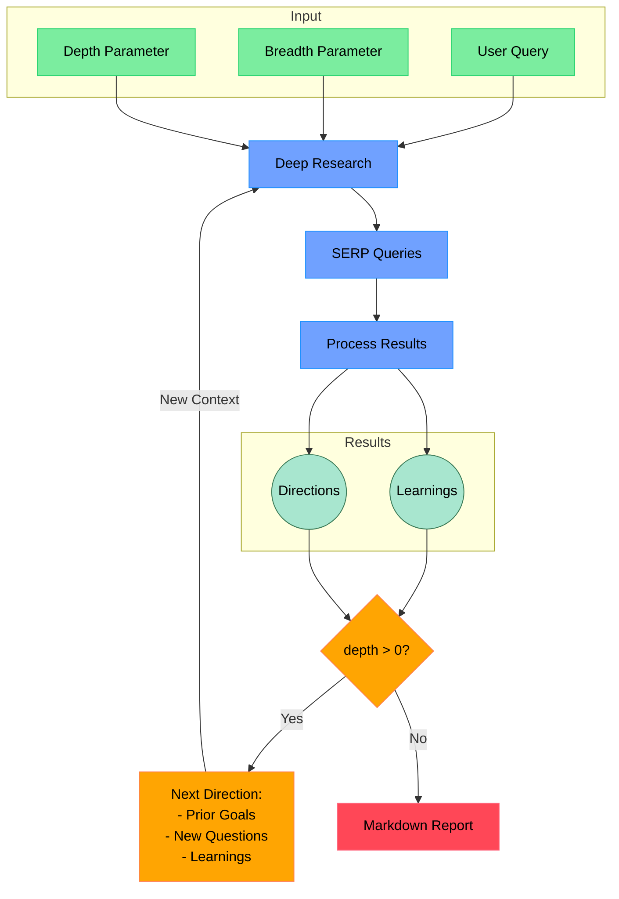
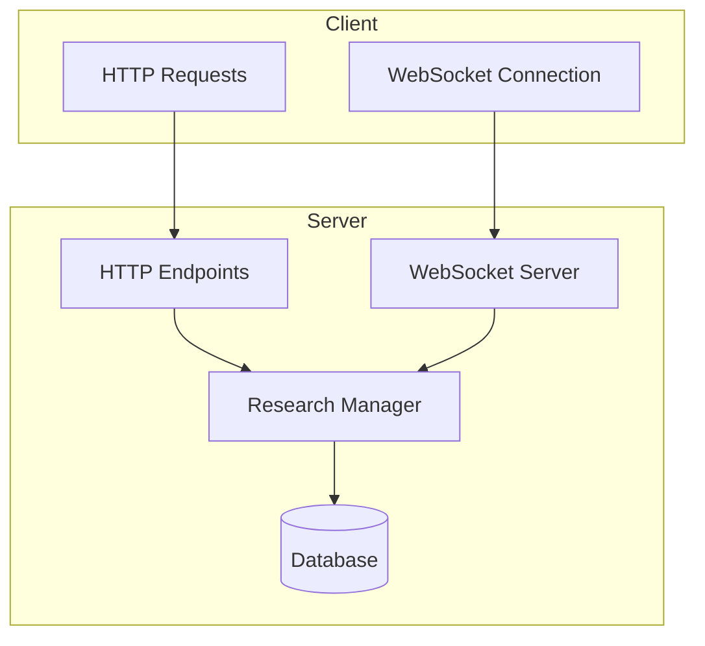

# Open Deep Research

An AI-powered research assistant that performs iterative, deep research on any topic by combining search engines, web scraping, and large language models.

The goal of this repo is to provide the simplest implementation of a deep research agent - e.g. an agent that can refine its research direction over time and deep dive into a topic. Goal is to keep the repo size at <500 LoC so it is easy to understand and build on top of.

If you like this project, please consider starring it and giving me a follow on [X/Twitter](https://x.com/dzhng). This project is sponsored by [Aomni](https://aomni.com).

## How It Works



## Features

- **Iterative Research**: Performs deep research by iteratively generating search queries, processing results, and diving deeper based on findings
- **Intelligent Query Generation**: Uses LLMs to generate targeted search queries based on research goals and previous findings
- **Depth & Breadth Control**: Configurable parameters to control how wide (breadth) and deep (depth) the research goes
- **Smart Follow-up**: Generates follow-up questions to better understand research needs
- **Comprehensive Reports**: Produces detailed markdown reports with findings and sources
- **Concurrent Processing**: Handles multiple searches and result processing in parallel for efficiency

## Requirements

- Node.js environment
- API keys for:
  - Firecrawl API (for web search and content extraction)
  - OpenAI API (for o3 mini model)
  - Admin API Key (for API key generation endpoint security)

## Setup

### Node.js

1. Clone the repository
2. Install dependencies:

```bash
npm install
```

3. Set up environment variables in a `.env.local` file:

```bash
FIRECRAWL_KEY="your_firecrawl_key"
# If you want to use your self-hosted Firecrawl, add the following below:
# FIRECRAWL_BASE_URL="http://localhost:3002"

OPENAI_KEY="your_openai_key"
```

To use local LLM, comment out `OPENAI_KEY` and instead uncomment `OPENAI_ENDPOINT` and `OPENAI_MODEL`:
- Set `OPENAI_ENDPOINT` to the address of your local server (eg."http://localhost:1234/v1")
- Set `OPENAI_MODEL` to the name of the model loaded in your local server.

### Docker

1. Clone the repository
2. Rename `.env.example` to `.env.local` and set your API keys

3. Run `npm install`

4. Run the Docker image:

```bash
docker compose up -d
```

5. Execute `npm run docker` in the docker service:
```bash
docker exec -it deep-research npm run docker
```

### Environment Variables

1. Copy `.env.sample` to `.env`
2. Set up the required API keys:

```env
# Search and LLM APIs
FIRECRAWL_KEY="your_firecrawl_key"
OPENAI_KEY="your_openai_key"

# Security: API Key Generation
# Generate a secure random string for protecting the API key generation endpoint
# You can use: node -e "console.log('sk_' + require('crypto').randomBytes(24).toString('base64').replace(/[+/=]/g, ''))"
KEY_GEN_API_KEY="your_admin_api_key"
```

The `KEY_GEN_API_KEY` is a crucial security measure that protects the API key generation endpoint. This admin API key is required when calling the endpoint to generate new user API keys. Make sure to:
1. Generate a secure random string for this key
2. Keep it private and only share with authorized administrators
3. Use different keys for development and production environments

## Usage

Run the research assistant:

```bash
npm start
```

You'll be prompted to:

1. Enter your research query
2. Specify research breadth (recommended: 3-10, default: 4)
3. Specify research depth (recommended: 1-5, default: 2)
4. Answer follow-up questions to refine the research direction

The system will then:

1. Generate and execute search queries
2. Process and analyze search results
3. Recursively explore deeper based on findings
4. Generate a comprehensive markdown report

The final report will be saved as `output.md` in your working directory.

### Concurrency

If you have a paid version of Firecrawl or a local version, feel free to increase the `ConcurrencyLimit` in `deep-research.ts` so it runs a lot faster.

If you have a free version, you may sometimes run into rate limit errors, you can reduce the limit (but it will run a lot slower).

### Custom endpoints and models

There are 2 other optional env vars that lets you tweak the endpoint (for other OpenAI compatible APIs like OpenRouter or Gemini) as well as the model string.

```bash
OPENAI_ENDPOINT="custom_endpoint"
OPENAI_MODEL="custom_model"
```

## How It Works

1. **Initial Setup**

   - Takes user query and research parameters (breadth & depth)
   - Generates follow-up questions to understand research needs better

2. **Deep Research Process**

   - Generates multiple SERP queries based on research goals
   - Processes search results to extract key learnings
   - Generates follow-up research directions

3. **Recursive Exploration**

   - If depth > 0, takes new research directions and continues exploration
   - Each iteration builds on previous learnings
   - Maintains context of research goals and findings

4. **Report Generation**
   - Compiles all findings into a comprehensive markdown report
   - Includes all sources and references
   - Organizes information in a clear, readable format

## License

MIT License - feel free to use and modify as needed.

## API Endpoints

### Generate API Key
Generate a unique API key for a user. This endpoint is secured and requires an admin API key.

```bash
curl -X POST http://localhost:3300/api/generate-api-key \
  -H "Content-Type: application/json" \
  -H "x-api-key: YOUR_ADMIN_API_KEY" \
  -d '{"username": "user123"}'
```

Response:
```json
{
  "userId": "user123_a1b2c3d4",
  "apiKey": "sk_xxxxxxxxxxxxx"
}
```

### Research Endpoints

#### Initiate Research
Start a new research session:
```bash
POST /api/research/initiate
```

#### Submit Answers
Submit answers to follow-up questions:
```bash
POST /api/research/submit-answers
```

#### Get Research Status
Check the status of a research session:
```bash
GET /api/research/:researchId/status
```

## Security

### API Key Generation Security
The system implements a two-tier API key structure:
1. Admin API Key (`KEY_GEN_API_KEY`):
   - Required to access the API key generation endpoint
   - Should be kept secure and only used by administrators
   - Used in the `x-api-key` header when calling the generate-api-key endpoint

2. User API Keys:
   - Generated through the secure endpoint
   - Unique to each user
   - Format: `sk_` prefix followed by random bytes
   - Used for accessing the research endpoints

Example of generating a new user API key:
```bash
# Replace YOUR_ADMIN_API_KEY with your KEY_GEN_API_KEY value
curl -X POST http://localhost:3300/api/generate-api-key \
  -H "Content-Type: application/json" \
  -H "x-api-key: YOUR_ADMIN_API_KEY" \
  -d '{"username": "user123"}'
```

## Development

1. Install dependencies:
```bash
npm install
```

2. Start the development server:
```

## Backend Architecture & Testing

### Overview

The backend implements a hybrid HTTP/WebSocket architecture:
- HTTP endpoints for API key management and initiating research
- WebSocket connections for real-time research progress updates



### Testing with cURL

1. First, generate an API key:
```bash
# Generate an API key for a new user
curl -X POST http://localhost:3300/api/generate-api-key \
  -H "Content-Type: application/json" \
  -H "x-api-key: YOUR_ADMIN_API_KEY" \
  -d '{"username": "testuser"}'

# Response will contain userId and apiKey
# {
#   "userId": "testuser_a1b2c3d4",
#   "apiKey": "sk_xxxxxxxxxxxxx"
# }
```

2. Initiate a research session:
```bash
# Start a new research session
curl -X POST http://localhost:3300/api/research/initiate \
  -H "Content-Type: application/json" \
  -H "Authorization: Bearer YOUR_USER_API_KEY" \
  -d '{
    "query": "What are the latest developments in quantum computing?",
    "breadth": 4,
    "depth": 2
  }'

# Response will contain researchId and followUpQuestions
# {
#   "researchId": "abc123xyz",
#   "followUpQuestions": [...]
# }
```

3. Submit answers to follow-up questions:
```bash
curl -X POST http://localhost:3300/api/research/submit-answers \
  -H "Content-Type: application/json" \
  -H "Authorization: Bearer YOUR_USER_API_KEY" \
  -d '{
    "researchId": "abc123xyz",
    "answers": [
      "Answer to question 1",
      "Answer to question 2"
    ]
  }'
```

4. Check research status:
```bash
curl http://localhost:3300/api/research/abc123xyz/status \
  -H "Authorization: Bearer YOUR_USER_API_KEY"
```

### Testing WebSocket Connection

You can use `wscat` to test WebSocket connections:

1. Install wscat:
```bash
npm install -g wscat
```

2. Connect to the WebSocket server:
```bash
wscat -c ws://localhost:3300
```

3. Subscribe to research updates:
```json
{
  "type": "subscribe",
  "researchId": "abc123xyz"
}
```

You'll receive real-time updates about:
- Research progress
- New findings
- Status changes
- Completion or errors

Example WebSocket messages:

```json
// Progress update
{
  "type": "update",
  "data": {
    "status": "in_progress",
    "progress": {
      "currentDepth": 2,
      "totalDepth": 2,
      "currentBreadth": 4,
      "totalBreadth": 4,
      "completedQueries": 3,
      "totalQueries": 8
    }
  }
}

// Completion message
{
  "type": "update",
  "data": {
    "status": "completed",
    "result": {
      "learnings": [...],
      "visitedUrls": [...],
      "report": "..."
    }
  }
}
```

### Backend Components

1. **HTTP Server (Express)**
   - Handles API key generation and management
   - Manages research session initialization
   - Processes follow-up question answers
   - Provides research status updates

2. **WebSocket Server**
   - Maintains real-time connections with clients
   - Broadcasts research progress updates
   - Manages client subscriptions to research sessions
   - Handles connection lifecycle (connect, disconnect, errors)

3. **Research Manager**
   - Coordinates the deep research process
   - Manages concurrent research sessions
   - Handles query generation and result processing
   - Updates progress and notifies subscribers

4. **Database Layer**
   - Stores user information and API keys
   - Manages research session data
   - Handles concurrent access and updates